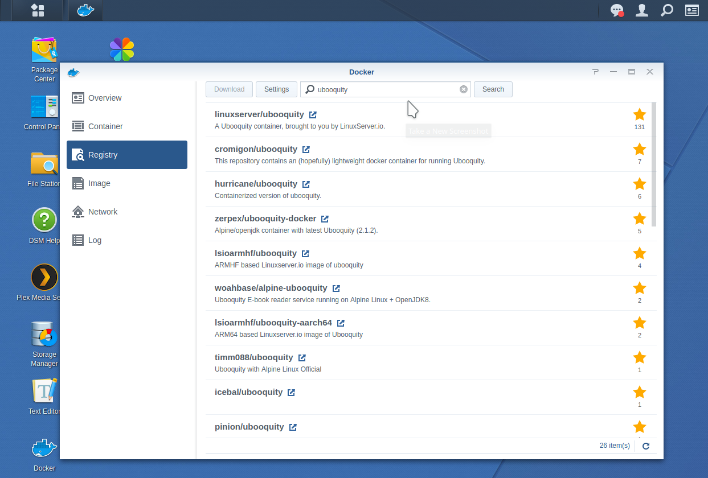
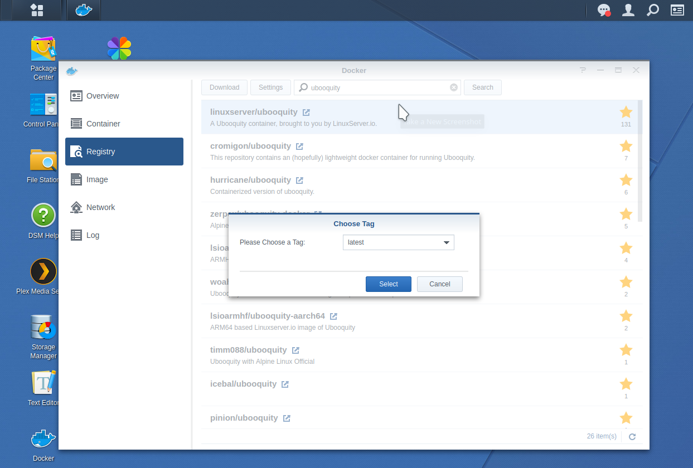
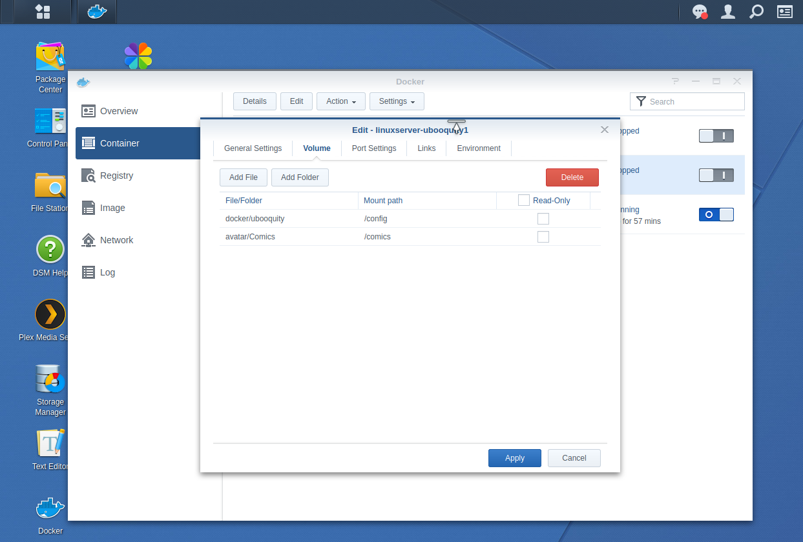

This is a guide to install [Ubooquity]() on a Synology NAS. There hasn't been many good instructions to install it, and for fools like me, it's good to sometimes go step by step. Note that this method is to install it using Docker. 

First off, SSH into your server. Ideally, your server will be something like `192.168.1.XX`

```bash
ssh <username>@<server-ip>
```

Next, figure out your PGID and PUID by running the command `id`

```bash
<username>@<server-ip>$ id
uid=<uid>(<username>) gid=<gid>(<username>)
```


Next, assuming you've already installed Docker from the Package Manager, go to the Docker directory, and create a directory called `ubooquity`. Here is where all of the config files will be located. Next, open up Docker, and in the `Registry` tab, look up `linuxserver/ubooquity`. Once you find it, install it.





Next, start to create a container by clicking on the `Advanced Settings` button. 


Under the `General Settings` tab, check the checkbox on "Enable auto-restart" (Optional)


Under the `Volume` tab, you'll need to create at least two folders: a configuration folder and a comics/raw/books folder. You should put the path to the Comics folder and set the mount path as `/comics`, and the configuration folder with the mount path `/config`. 



Under the `Port Settings` tab, there will already be two local ports. In my experience, I wasn't able to get it to work properly with the defaults, so I simply replaced `Auto` with the same port number


Finally, under the `Environment` tab, add in the variables `PGID` and `PUID` with the values obtained from running the `id` command above (i.e. `<uid>` and `<gid>` respectively)


Now, you'll have created a container. Next, you'll need to go to the `<server-ip>:2203/ubooquity/admin` to set up an admin password, and then it you'll be able to see its settings. In order to access your server, go to `<server-ip>:2202/ubooquity`


## Accessing the Server

### Android - Kuboo

You can access your server via different ways now. One way is [Kuboo](https://github.com/sethchhim/Kuboo) developed by Seth Chhim

First, in the admin comfiguration, in the `Advanced` tab, you need to check the `Enable OPDS feed`, which will allow your books and comics to be accessed to the server via `<server-ip>:2202/opds-books` in the application on Android. 

In order to access it remotely, ideally you should have already set a external website. In many cases, it is `<chosen-name>.synology.me`. In your router, you need to [allow for the ports to be forwarded](nicolasshu.com/port_forwarding_netgear.html). In this case, you need to forward the port 2202. 

### iPad - Chunky Comic Reader

You can access it via [Chunky Comic Reader](https://apps.apple.com/pe/app/chunky-comic-reader/id663567628?l=en) for the iPad


## Alternative

If you have enabled Samba or FTP on your server, you can access your files directly (or via FTP) via the application [CDisplay Ex](https://www.cdisplayex.com/). I always loved using the program [CDisplay] by David Ayton, but he passed away in 2003, where Derek Quenneville continued hosting his website. Then a guy (unnamed) continued his work with CDisplay Ex. He actually does a really good job in bringing back CDisplay, and he made an Android application. This is in fact my application of choice for reading via SMB. 

In order to access the files via Samba, you need to set one (or both) of the following:

- Samba (for local access) - This is nice so that you don't have to download anything
  - Description: Anything
  - Scheme: Samba
  - Host name: `<name-of-server>` (e.g. Brainiac)
  - Username: `<username-to-server>`
  - Password: `<password>`
  - Path: `<path/to/comics>` (e.g. /avatar/Comics/)
- FTP (for remote access)
  - Description: Anything
  - Scheme: Ftp
  - Host name: `<name>.synology.me`
  - Username: `<username-to-server>`
  - Password: `<password>`
  - Path: `<path/to/comics>` (e.g. /avatar/Comics/)

