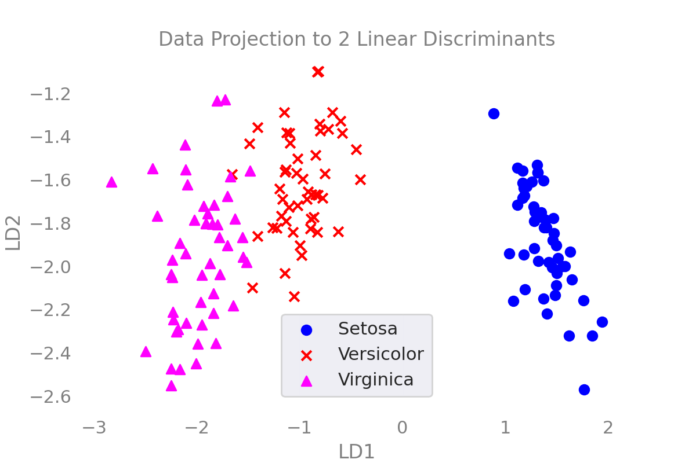

This post was highly inspired by [Sebastian Raschka](https://sebastianraschka.com/)'s [post](https://sebastianraschka.com/Articles/2014_python_lda.html)

The goal of LDA is to find some linear transformation $\mathbf{x} \rightarrow \mathbf{x}^T W$ that maximizes the between-class covariance with respect to the within-class covariance. 

$$\uparrow \frac{S_b}{S_w}$$

Here, we can do LDA in a few steps
1. Compute the mean vectors of the features for each of the different classes
1. Compute the covariance matrices (between-class and within-class covariance matrices)
1. Compute the eigenvectors and eigenvalues for the covariance matrices
1. Sort the eigenvectors by the eigenvalues and choose the top $k$ eigenvectors to obtain the transformation matrix $W$
1. Use the transformation matrix $W$ to transform the data

So, let us say that we have a dataset $X$, such that there are $N$ examples, and $F$ features
$$X \in \mathbb{R}^{N \times F}$$

And we have its labels $y \in \mathbb{R}^N$

Let us say that there are $C$ total classes, and $N_c$ represents the number of examples in the class $c$, where $c \in [1, C]$, and the dataset $\mathcal{D}_c$ represents all of the examples in the class $c$.

## Import Libraries

```python
import pandas as pd
import numpy as np
import matplotlib.pyplot as plt
from tqdm import tqdm

from sklearn.preprocessing import LabelEncoder
```

## Setup Dataset

```python
df = pd.io.parsers.read_csv(
    filepath_or_buffer='https://archive.ics.uci.edu/ml/machine-learning-databases/iris/iris.data',
    header=None,
    sep=',',
    )
label_dict = {
    0: "Setosa",
    1: "Versicolor",
    2: "Virginica"
}
feature_dict = {0:'sepal_length',
                1:'sepal_width',
                2:'petal_length',
                3:'petal_width'}
df.columns = list(feature_dict.values())+["label"]
df.dropna(how="all", inplace=True) 

X = df.iloc[:,[0,1,2,3]].values
y = df["label"].values
enc = LabelEncoder()
enc = enc.fit(y)
y = enc.transform(y)
num_classes = len(np.unique(y))
N,F = X.shape
```

## Step 1: Compute the mean vectors

Here, we can compute the mean vectors $\mathbf{m}_c$, where $c \in [1,C]$, with  

$$\mathbf{m}_c = \frac{1}{|\mathcal{D}_c|} \sum_{\mathbf{x} \in \mathcal{D}_c} \mathbf{x}$$

Note that here, $\mathbf{x} \in \mathbb{R}^F$, as a column vector. Also note that $\mathbf{m}$ represents the overall mean of the whole dataset
$$\mathbf{m} = \frac{1}{|X|} \sum_{\mathbf{x} \in X} \mathbf{x}$$

```python
mean_vectors = []
for label in range(num_classes):
    mu_c = np.mean(X[y==label],axis=0)
    mean_vectors.append(mu_c)
m = np.mean(X,axis=0).reshape(F,1)
```

## Step 2: Compute the Covariance Matrices
### Class Covariance
To compute a class covariance $S_c$, we can have 
$$S_c = \sum_{\mathbf{x} \in \mathcal{D}_c} (\mathbf{x}-\mathbf{m}_c)(\mathbf{x}-\mathbf{m}_c)^T$$

### Within-Class Covariance 
To compute the within-class covariance, 
$$S_w = \sum_{c=1}^C S_c \in \mathbb{R}^{F \times F}$$

### Between-Class Covariance
The between-class covariance can be computed as
$$S_b = \sum_{c=1}^C |\mathcal{D}_c| (\mathbf{m}_c - \mathbf{m}) (\mathbf{m}_c - \mathbf{m})^T \in \mathbb{R}^{F\times F}$$

```python
def class_covariance(_class):
    global mean_vectors
    S_c = np.zeros((F,F))
    m_c = mean_vectors[_class].reshape(F,1)
    for x in X[y==_class]:
        x = x.reshape(F,1)
        S_c += (x-m_c).dot((x-m_c).T)
    return S_c

# Within Class Covariance
S_w = np.zeros((F,F))
for class_num in range(num_classes):
    S_w += class_covariance(class_num)

# Between Class Covariance
S_b = np.zeros((F,F))
for class_num in range(num_classes):
    N_c, _ = X[y==class_num].shape
    m_c = mean_vectors[class_num].reshape(F,1)
    S_b += N_c * (m_c - m).dot((m_c - m).T)
```

```python
print("Within-class Covariance")
print(S_w)
print("Between-class Covariance")
print(S_b)
```

```
Within-class Covariance
[[38.9562 13.683  24.614   5.6556]
 [13.683  17.035   8.12    4.9132]
 [24.614   8.12   27.22    6.2536]
 [ 5.6556  4.9132  6.2536  6.1756]]
Between-class Covariance
[[ 63.21213333 -19.534      165.16466667  71.36306667]
 [-19.534       10.9776     -56.0552     -22.4924    ]
 [165.16466667 -56.0552     436.64373333 186.90813333]
 [ 71.36306667 -22.4924     186.90813333  80.60413333]]

```

## Step 3: Solve the Generalized Eigenvalue Problem
So, here, we understand that the `eig(A)` function solves for the eigenvalues and eigenvectors of $A$, where $A\mathbf{v} = \lambda \mathbf{v}$. Now, the linear constraints are such that 
$$S_b \mathbf{v} = \lambda S_w \mathbf{v}$$
$$ \underbrace{S_w^{-1}S_b}_{A} \mathbf{v} = \lambda \mathbf{v}$$

Therefore, we can compute the eigv*'s for it as 
$$eig(\underbrace{S_w^{-1}S_b}_{\mathbb{R}^{F\times F}})$$

```python
A = np.linalg.inv(S_w).dot(S_b)
eigval, eigvec = np.linalg.eig(A)
```

```python
# Show the Eigenvalue Solutions
for k in range(len(eigval)):
    evec = eigvec[:,k].reshape(F,1)
    print("Eigval: ",eigval[k])
    print("Eigvec: \n",evec)
    print("")
    np.testing.assert_array_almost_equal(
        np.linalg.inv(S_w).dot(S_b).dot(evec),
        eigval[k]*evec,
        decimal = 6, verbose=True
    )
print("All eigvecs and eigvals match.")
```

```
Eigval:  32.27195779972981
Eigvec: 
 [[ 0.20490976]
 [ 0.38714331]
 [-0.54648218]
 [-0.71378517]]

Eigval:  0.27756686384004264
Eigvec: 
 [[-0.00898234]
 [-0.58899857]
 [ 0.25428655]
 [-0.76703217]]

Eigval:  -4.1311796919088535e-15
Eigvec: 
 [[-0.83786868]
 [ 0.16963186]
 [ 0.12293803]
 [ 0.50407077]]

Eigval:  1.1953730364935478e-14
Eigvec: 
 [[ 0.20003692]
 [-0.39490682]
 [-0.45668159]
 [ 0.77167076]]

All eigvecs and eigvals match.
```

## Step 4: Select the linear discriminants for the new latent subspace
Here, all you have to do is to find the top $k$ eigenvalues and their respective eigenvectors. And then set the transformation. So, if $\mathbf{w}_F$ is the eigenvector associated with the largest eigenvalue $\lambda_F$, and $\mathbf{w}_1$ is the eigenvector associated with the smallest eigenvalue $\lambda_1$ of $S_w^{-1}S_b$, and 
$$\lambda_1 \leq \lambda_2 \leq \cdots \leq \lambda_F$$

Then the transformation matrix $W$ is 
$$W = \begin{bmatrix}
| & | & & | \\ 
\mathbf{w}_F & \mathbf{w}_{F-1} & \cdots & \mathbf{w}_{F-k} \\
| & | & & | \\ 
\end{bmatrix} \in \mathbb{R}^{F \times k}$$

```python
eigenpairs = [
    (np.abs(eigval[k]), eigvec[:,k]) for k in range(len(eigval))
]
```

```python
# Show the Sorted Eigen Pairs
print("Unsorted: ")
for eval,evec in eigenpairs:
    print(eval,"\t",evec)

print("")
eigenpairs = sorted(eigenpairs, key=lambda pair: pair[0],reverse=True)
print("Sorted in Decreasing Order: ")
for eval,evec in eigenpairs:
    print(eval,"\t",evec)

print("")
tot_eigval = np.sum(eigval)
for i,(e_val, e_vec) in enumerate(eigenpairs):
    print("Eigenvalue {}: {:.2f}%".format(i,e_val/tot_eigval*100))
```
```
Unsorted: 
32.27195779972981 	 [ 0.20490976  0.38714331 -0.54648218 -0.71378517]
0.27756686384004264 	 [-0.00898234 -0.58899857  0.25428655 -0.76703217]
4.1311796919088535e-15 	 [-0.83786868  0.16963186  0.12293803  0.50407077]
1.1953730364935478e-14 	 [ 0.20003692 -0.39490682 -0.45668159  0.77167076]

Sorted in Decreasing Order: 
32.27195779972981 	 [ 0.20490976  0.38714331 -0.54648218 -0.71378517]
0.27756686384004264 	 [-0.00898234 -0.58899857  0.25428655 -0.76703217]
1.1953730364935478e-14 	 [ 0.20003692 -0.39490682 -0.45668159  0.77167076]
4.1311796919088535e-15 	 [-0.83786868  0.16963186  0.12293803  0.50407077]

Eigenvalue 0: 99.15%
Eigenvalue 1: 0.85%
Eigenvalue 2: 0.00%
Eigenvalue 3: 0.00%
```

By looking at this, it looks like the most informative eigenpairs are the top 2

```python
k = 2
```

## Step 5: Transform the Data to the Latent Subspace
Now, the samples in the data space can be placed in the latent subspace by multiplying it by the transformation matrix $W$ 
$$\underbrace{U}_{\mathbb{R}_{N \times k}} = \underbrace{X}_{\mathbb{R}^{N\times F}}\underbrace{W}_{\mathbb{R}^{F \times k}}$$

This will lead that $W$ will be able to diagonalizes both $S_b$ and $S_w$, making LDA able to decorrelate the data between and within classes. 

$$W^T S_b W = \begin{bmatrix}
* & & & \\
 & * & & \\
 & & \ddots & \\
 & & & *
\end{bmatrix}$$
$$W^T S_w W = \begin{bmatrix}
* & & & \\
 & * & & \\
 & & \ddots & \\
 & & & *
\end{bmatrix}$$

```python
W = np.zeros((F,k))
for i in range(k):
    W[:,i] = eigenpairs[i][1]
X_lda = X.dot(W)
```
```python
print("X.shape: ",X.shape)
print("W.shape: ",W.shape)
print("X_lda.shape: ", X_lda.shape)
```
```
X.shape:  (150, 4)
W.shape:  (4, 2)
X_lda.shape:  (150, 2)
```

## Showing the Results
```python
markers = ["o","x","^"]
colors = ["blue","red","cyan"]
fig,ax = plt.subplots()
for i in range(num_classes):
    X_c = X_lda[y==i]
    ax.scatter(
        x = X_c[:,0],
        y = X_c[:,1],
        marker=markers[i],
        color=colors[i],
        label = label_dict[i]
    )
ax.set_xlabel("LD1")
ax.set_ylabel("LD2")
ax.set_title("Data Projection to 2 Linear Discriminants")
ax.grid()
ax.legend()
```

