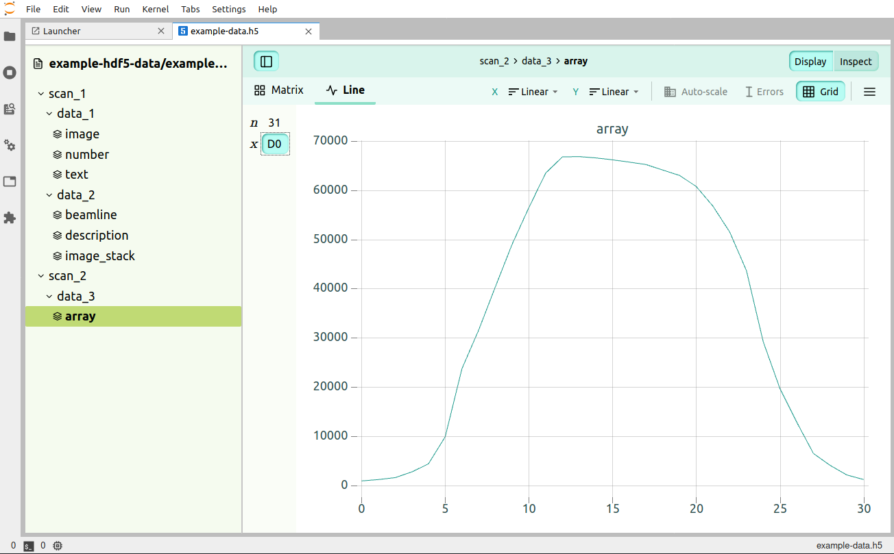
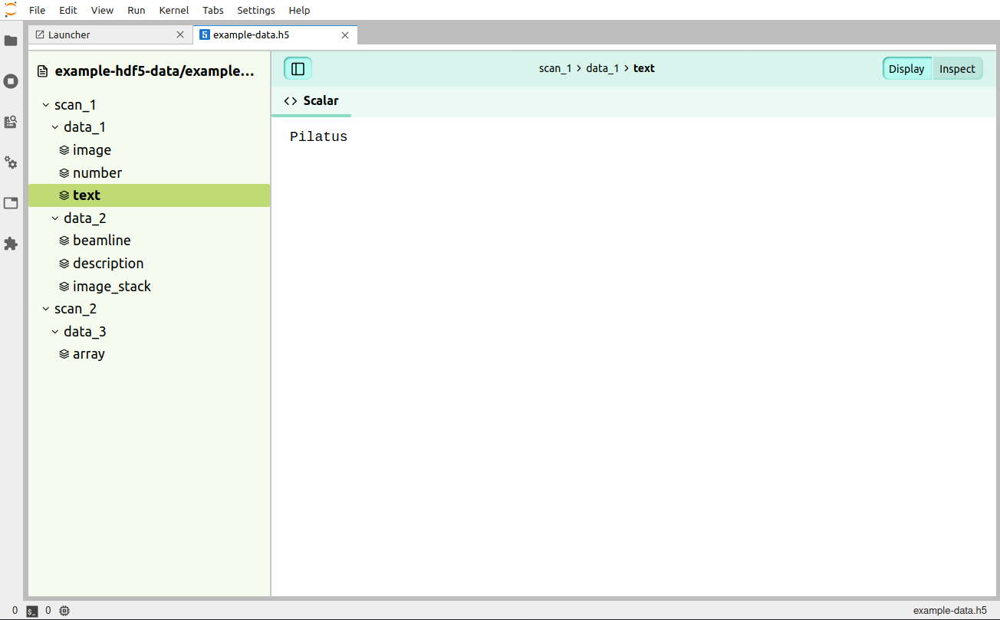
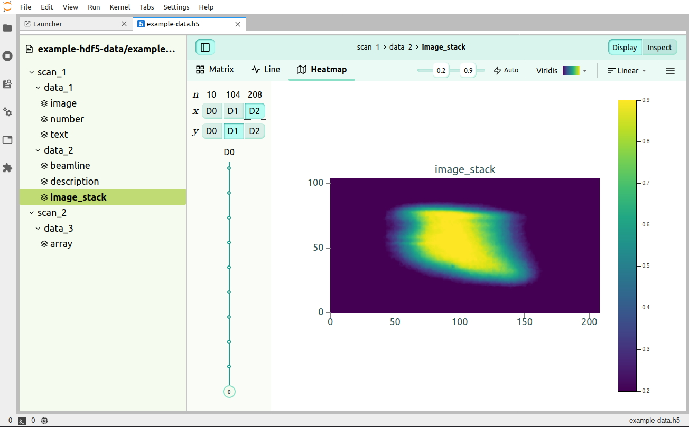

Sometimes in different scientific fields, one may end up using a lot of [BLOB](https://en.wikipedia.org/wiki/Binary_large_object) data. Thus, there are different ways to store the data. One of the ways that one may wish to install their data, such as hyperspectral images, is to store it in HDF5. With such, one may sometimes wish to view their data, since it will likely be saved in a `.h5` format. Loic Huder created a tool, which he presented with the [YouTube hdf5 channel](https://youtu.be/3GNOOdDR-YU), where he's been keeping his repository on GitHub [here](https://github.com/silx-kit/h5web). At the moment of writing this post, I still have not yet figured out how to install it properly. However, an alternative is to use it within Jupyter Lab ([source](https://github.com/silx-kit/jupyterlab-h5web)).

In order to do so, you may use a Jupyter Lab version greater than 2.2.5, e.g.:

```
pip install jupyterlab==2.2.8
```

Then to install the extension,

```bash
pip install jupyterlab_h5web 

# OR for blosc and bitshuffle files
# pip install jupyterlab_h5web[full]

jupyter lab build
```

Finally, you will be ablet open the HDF5 files by going to Jupyter Lab and viewing the files. As an example, [here](../assets/images/h5web/example-data.h5) is a sample HDF5 file. Below are a few examples of how it'd look like



