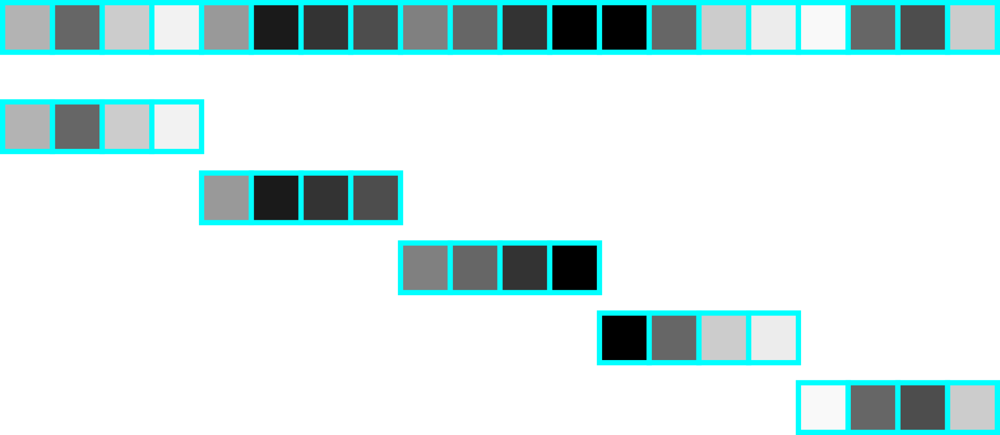
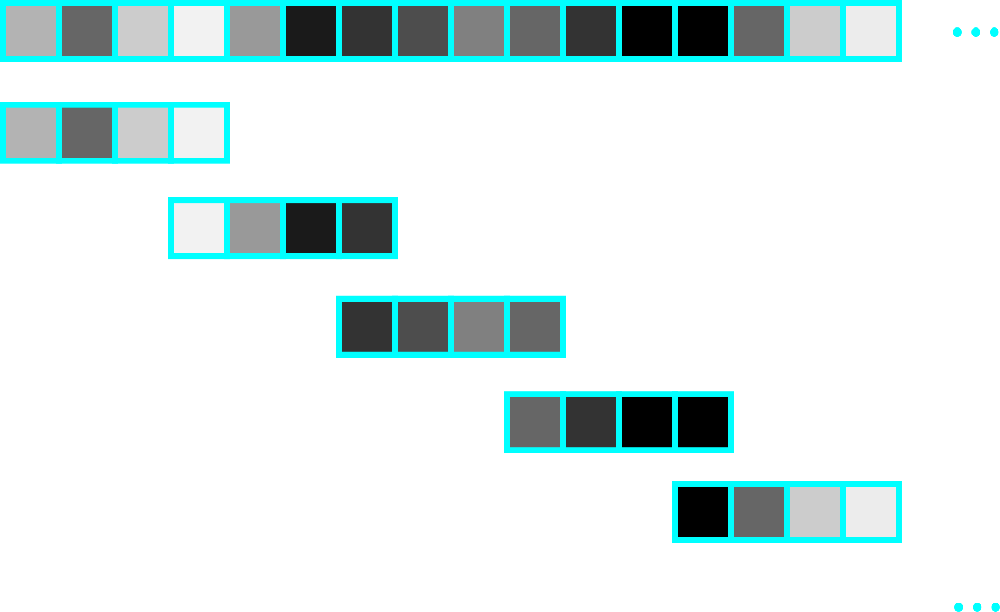
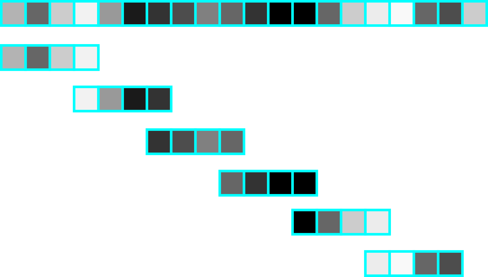

Alright, this is something that I am sick of having to figure out over and over again. Sliding window. 


## Case 1: Stride Length = Window Length



Let us first consider the simplest case: where are trying to pass a window through some data, and your stride length equals the window length. If we were to know *a priori* the number of times we'd like to iterate through (e.g. 10 iterations), then this is the simplest case. We can simply let it iterate through integers, and ad a factor of the length of the window

```python
window_length = 15

for k in range(10):
    start = k * window_length
    stop = (k+1) * window_length
    print(start, stop)

# Output 
# 0 15
# 15 30
# 30 45
# 45 60
# 60 75
# 75 90
# 90 105
# 105 120
# 120 135
# 135 150
```

If we however have a finite array with $N$ elements, we need to know the number of segments $n_{frames}$ we will need. With this, we can determine it by simply compute it by dividing the number of elements by the window length and flooring it

$$n_{frames} = \bigg\lfloor \frac{N}{window\_length} \bigg\rfloor$$

```python
data = np.arange(100)
window_length = 16
N = data.shape[0]
n_frames = N // window_length
for k in range(n_frames):
    start = k * window_length
    stop = (k+1) * window_length
    print(start, stop, "\t", len(data[start:stop]))

# Output

#  0 16     [ 0  1  2  3  4  5  6  7  8  9 10 11 12 13 14 15]
# 16 32     [16 17 18 19 20 21 22 23 24 25 26 27 28 29 30 31]
# 32 48     [32 33 34 35 36 37 38 39 40 41 42 43 44 45 46 47]
# 48 64     [48 49 50 51 52 53 54 55 56 57 58 59 60 61 62 63]
# 64 80     [64 65 66 67 68 69 70 71 72 73 74 75 76 77 78 79]
# 80 96     [80 81 82 83 84 85 86 87 88 89 90 91 92 93 94 95]
```

## Case 2: Infinite Data



Let us consider the case we now do not have the window length to be equal to the stride length. Let us also consider that we either know *a priori* the number of iterations we wish to go through, or we have infinite data. Let $k$ be the iteration number. We now change the start and end indices to

$$\begin{align}
    start &= k \cdot stride\_length \\ 
    stop &= k \cdot stride\_length  + window\_length
\end{align}$$

```python
stride_length = 10
window_length = 16

for k in range(10):
    start = k * stride_length
    stop = k * stride_length + window_length
    print(start,stop)

# Output

#  0 16
# 10 26
# 20 36
# 30 46
# 40 56
# 50 66
# 60 76
# 70 86
# 80 96
# 90 106
```

## Case 3: Finite Data



Now, let us consider the case that we have a finite data with differing window lengths and stride lengths. In such case, we first need to determine the number of frames we'll need. Let $N$ represent the number of data points you possess. This can be computed by 

$$n_{frames} = \bigg \lfloor \frac{N - window\_length}{stride\_length} \bigg \rfloor + 1$$

We can the iterate it with the same formulation above, where $k$ represents the iteration number

$$\begin{align}
    start &= k \cdot stride\_length \\ 
    stop &= k \cdot stride\_length  + window\_length
\end{align}$$

Thus, its implementation is

```python
stride_length = 4
window_length = 6
data = np.arange(100)
N = data.shape[0]
n_frames = ((N - window_length)  // stride_length) + 1
for k in range(n_frames):
    start = k * stride_length
    stop = k * stride_length + window_length
    print("({:>2}) {:>2} {:>2}".format(k, start,stop), data[start:stop])

# Output

# ( 0)  0 13	 [ 0  1  2  3  4  5  6  7  8  9 10 11 12]
# ( 1)  7 20	 [ 7  8  9 10 11 12 13 14 15 16 17 18 19]
# ( 2) 14 27	 [14 15 16 17 18 19 20 21 22 23 24 25 26]
# ( 3) 21 34	 [21 22 23 24 25 26 27 28 29 30 31 32 33]
# ( 4) 28 41	 [28 29 30 31 32 33 34 35 36 37 38 39 40]
# ( 5) 35 48	 [35 36 37 38 39 40 41 42 43 44 45 46 47]
# ( 6) 42 55	 [42 43 44 45 46 47 48 49 50 51 52 53 54]
# ( 7) 49 62	 [49 50 51 52 53 54 55 56 57 58 59 60 61]
# ( 8) 56 69	 [56 57 58 59 60 61 62 63 64 65 66 67 68]
# ( 9) 63 76	 [63 64 65 66 67 68 69 70 71 72 73 74 75]
# (10) 70 83	 [70 71 72 73 74 75 76 77 78 79 80 81 82]
# (11) 77 90	 [77 78 79 80 81 82 83 84 85 86 87 88 89]
# (12) 84 97	 [84 85 86 87 88 89 90 91 92 93 94 95 96]
```


Done. Get to work. 