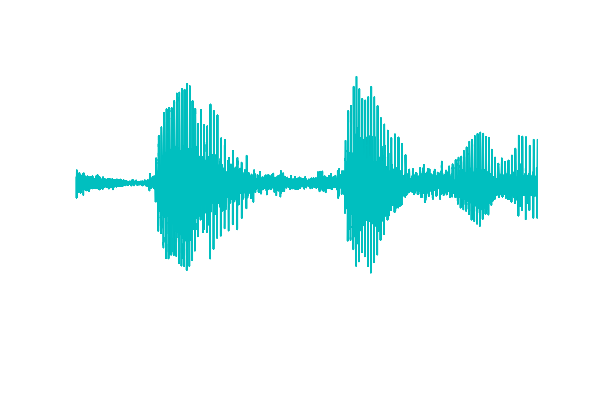

Here is a couple of things to remember about dealing with audio files in Python

## Loading Audios

### Scipy
There are multiple packages where one can use to load audio files. With respect to `.wav` files, the immediate one that people consider using is from `scipy.io`. More specifically, one may use the following template to load an audio data along with its sampling rate: 

```python
import scipy.io.wavfile as wavfile
fs,audio = wavfile.read("audio1.wav")
```

Then if one plots it, one will see the following 



However, if there's anything that I could tell someone is to NOT use Scipy's Wavfile module to read in `.wav` files, because it imports data as integers. This is a problem because we may not know exactly the bit resolution and thus we don't know how to properly scale it. Usually, it's best for us to keep the values between -1 and 1. 

### Soundfile

Alternatively, one may use one of the following 
- [SoundFile](https://pysoundfile.readthedocs.io/en/latest/)'s [`read`](https://pysoundfile.readthedocs.io/en/latest/#soundfile.read) function
- [Librosa](https://librosa.org/doc/latest/index.html)'s [`load`](https://librosa.org/doc/main/generated/librosa.load.html) function

If one uses `soundfile`, one may use the following template:

```python
import soundfile as sf
audio,fs = sf.read("audio1.wav")
```

And if one plots it, one will observe the following plot 


One can clearly see that the amplitude values range between -1 and 1, where as for Scipy, it tries to keep the values as integers. This instead then comes properly scaled.

### Librosa

As a third option, and what I actually prefer, is to use `librosa`. Below is a template to load audio files. 

```python
import librosa
audio,fs = librosa.load("audio1.wav",sr=None)
```

And if one is to plot the result, one would see the following plot:


I actually prefer `librosa` because the folks who built this library wrote it to be adaptable so that it takes almost every audio file type. For example, it even works with `.mp3` files. 

```python
audio, fs = librosa.load("audio2.mp3",sr=None)
```

Note that I put the sampling rate parameter `sr` as `None`. The reason for that is that `librosa` was built to work super well with its entire ecosystem, and it forces the sampling rate to be 22050 Hz by default. In order to load the audio to be its original value, one needs to pass the `None` value to the sampling rate parameter. 

